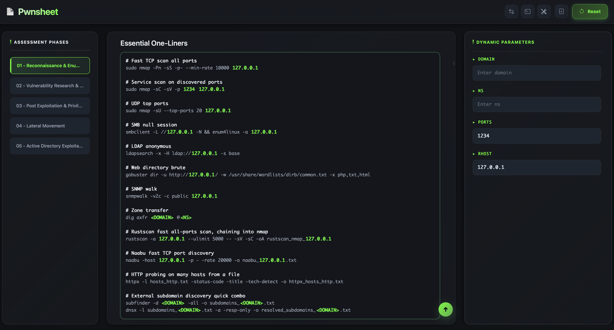

# 📄 Pwnsheet - Dynamic Pentesting Cheatsheet

[](https://opensource.org/licenses/MIT)
[](https://getbootstrap.com)

> ⚠️ **Disclaimer**
>
> **Pwnsheet is for educational and authorized security testing only.**
> - Only use this tool on systems for which you have explicit permission to perform testing
> - Authors are not responsible for misuse  

## 🎯 What is Pwnsheet?

A smart, interactive cheatsheet designed to streamline penetration testing assessments. Pwnsheet transforms static markdown checklists into a dynamic, browser-based workspace with intelligent parameter management and progress tracking.

 

## ✨ Key Features

Everything follows an interactive, dynamic approach—helpers react to your inputs and keep commands in sync.

- **📋 Phase-Based Workflow** - Cheatsheet for all pentesting phases from reconnaissance to lateral movement
- **🎯 Dynamic Parameters** - Click any code block to filter relevant parameters; auto-populate commands across the assessment
- **✅ Progress Tracking** - Interactive checkboxes with persistent state to track your assessment progress
- **📦 Zero Dependencies** - Pure HTML/CSS/JS with no build process; runs entirely in the browser
- **💾 Local Storage** - All progress and parameters saved locally; nothing leaves your machine
- **🎨 Modern UI** - Clean, responsive interface optimized for security professionals
- **🚚 File Transfer Helper** - Generates sender/receiver commands for faster file moves across hosts
- **🐚 Shells Helper** - Reverse shell oneliners, web shells, and stabilization commands on demand
- **🧰 Tools & Wordlists Table** - Quick download/install commands for common tools and wordlists
- **📝 Skeleton Notes Downloader** - Grab templated markdown notes to capture findings during assessments

## 🚀 Quick Start

```bash
# Clone the repository
git clone https://github.com/0x8e5afe/pwnsheet.git
cd pwnsheet

# Start a local server
python3 -m http.server 8000

# Open in browser
# Navigate to http://localhost:8000
```

## 📖 How to Use

### 1. Select a Phase
Click any phase in the left panel to load its checklist:
- Reconnaissance & Enumeration
- Vulnerability Assessment & Web Testing
- Exploitation (Infrastructure & Web)
- Post Exploitation & Privilege Escalation
- Active Directory Exploitation
- Lateral Movement
- Pivoting with Ligolo-ng & Tunneling Strategy

### 2. Work with Parameters
Parameters appear in the right panel when present in a phase. They use the format `<PARAMETER_NAME>` or `{{PARAMETER_NAME}}`:

- **Global Mode** - Fill parameters to auto-populate throughout the entire phase
- **Code Block Mode** - Click any code block to filter only its relevant parameters
- **Search** - Use the search box to quickly find specific parameters

Example workflow:
```bash
# Phase contains: nmap -sV -p- <TARGET_IP>
# Enter 10.10.11.45 in TARGET_IP parameter
# Command auto-updates to: nmap -sV -p- 10.10.11.45
```

### 3. Track Progress
- Check off completed tasks as you go
- All checkbox states persist between sessions
- Use the Reset button to start a fresh assessment

### 4. Copy Commands
- Simply highlight the piece of code in a snippet to copy it

## 🏗️ Project Structure

```
pwnsheet/
├── index.html          # Main application shell
├── scripts             # Core functionality split by concern
│   ├── constants.js    # Shared state, regexes, templates
│   ├── utils.js        # Marked setup + style helpers
│   ├── copy.js         # Copy/selection feedback utilities
│   ├── modals.js       # Modal logic, generators, tables
│   ├── content.js      # Markdown rendering + parameter wiring
│   └── main.js         # Entry point + global event wiring
├── styles.css          # UI styling and theme
├── README.md           # This file
└── notes               # markdown notes
    ├── 01 - Reconnaissance & Enumeration.md
    ├── 02 - Vulnerability Research & Exploitation.md
    ├── 03 - Post Exploitation & Privilege Escalation.md
    ├── 04 - Lateral Movement.md
    ├── 05 - Active Directory Exploitation.md
```

## 🤝 Contributing

Contributions are welcome! Here's how you can help:

### Reporting Issues
- Check existing issues first to avoid duplicates
- Provide clear reproduction steps
- Include browser/OS information for UI bugs

### Suggesting Enhancements
- Open an issue describing the feature
- Explain the use case and benefits
- Consider implementation complexity

### Submitting Pull Requests
1. Fork the repository
2. Create a feature branch: `git checkout -b feature/your-feature-name`
3. Make your changes with clear, descriptive commits
4. Test thoroughly across different browsers
5. Submit a PR with a clear description of changes

### Content Guidelines
When adding or modifying assessment phases:
- Keep commands practical and commonly used
- Add brief explanations for complex techniques
- Use consistent parameter naming conventions
- Include relevant tool documentation links
- Maintain ethical hacking principles

## 📜 License

This project is licensed under the **MIT License**. See [`LICENSE`](LICENSE) for details.

## ⚖️ Ethical Use

This tool is designed for **authorized security testing only**. Users must:
- Obtain proper authorization before testing any systems
- Comply with all applicable laws and regulations
- Respect scope limitations and rules of engagement
- Use knowledge responsibly and ethically

Unauthorized access to computer systems is illegal. The authors assume no liability for misuse.

---

<div align="center">

Made with ❤️ by [Giuseppe Toscano](https://0x8e5afe.github.io/portfolio/)

[⭐ Star on GitHub](https://github.com/0x8e5afe/cybersuite)

</div>
